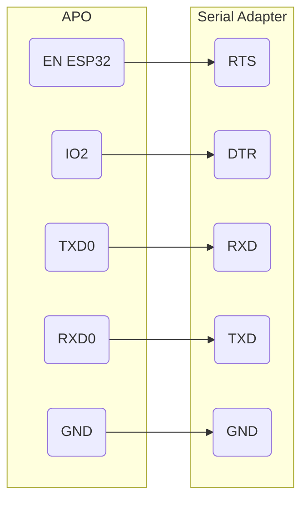

# Serial Console

## Prerequisites

- [esptool](https://docs.espressif.com/projects/esptool/en/latest/esp32/installation.html)
- [USB to Serial adapter (must have RTS and DTR pins)](https://www.amazon.com/dp/B00IJXZQ7C)
- [Female-to-female dupont connecting wires](https://www.amazon.com/dp/B01EV70C78)

## Configuration

1. Remove the rear cover of the oven.
2. Remove the plastic cover protecting the PCB.


3. Connect the USB-to-serial adapter to the debug pins.  In order to use the [automatic bootloader](https://docs.espressif.com/projects/esptool/en/latest/esp32/advanced-topics/boot-mode-selection.html#automatic-bootloader), all 5 pins must be connected as follows:




## Connecting To The Oven

The following instructions apply to MacOS only, though Linux should be fairly similar.

1. Plug the USB-to-serial adapter into your computer _before_ plugging in the oven (at least in my case it only worked this way).

2.  Find the path to your adapter:

```
ls /dev/cu.*
```

3. Open a screen session:

```
screen <path_to_adapter> 230400
```

4. Plug in the oven.

```
(31) boot: compile time 11:04:31
(31) boot: Enabling RNG early entropy source...
(34) boot: SPI Speed      : 40MHz
(36) boot: SPI Mode       : DIO
(38) boot: SPI Flash Size : 4MB
(40) boot: Partition Table:
(42) boot: ## Label            Usage          Type ST Offset   Length
(45) boot:  0 nvs              WiFi data        01 02 00009000 00004000
(49) boot:  1 otadata          OTA data         01 00 0000d000 00002000
(53) boot:  2 phy_init         RF data          01 01 0000f000 00001000
(57) boot:  3 factory          factory app      00 00 00010000 0012c000
(60) boot:  4 storage          Unknown data     01 82 0013c000 00032000
(64) boot:  5 ota_0            OTA app          00 10 00170000 0012c000
(68) boot:  6 ota_1            OTA app          00 11 002a0000 0012c000
(72) boot:  7 coredump         Unknown data     01 03 003cc000 00030400
(75) boot: End of partition table
(77) boot: Defaulting to factory image
(80) esp_image: segment 0: paddr=0x00010020 vaddr=0x3f400020 size=0x38b8c (232332) map
(173) esp_image: segment 1: paddr=0x00048bb4 vaddr=0x3ffb0000 size=0x05be8 ( 23528) load
(183) esp_image: segment 2: paddr=0x0004e7a4 vaddr=0x40080000 size=0x01874 (  6260) load
(185) esp_image: segment 3: paddr=0x00050020 vaddr=0x400d0020 size=0xc8e20 (822816) map
(499) esp_image: segment 4: paddr=0x00118e48 vaddr=0x40081874 size=0x17af8 ( 97016) load
(557) boot: Loaded app from partition at offset 0x10000
(557) boot: Disabling RNG early entropy source...
(557) cpu_start: Pro cpu up.
(559) cpu_start: Application information:
(561) cpu_start: Project name:     oven-controller
(564) cpu_start: App version:      v2.1.10
(567) cpu_start: Compile time:     Jun 12 2024 07:37:16
(570) cpu_start: ELF file SHA256:  5561988ff1a0a360...
(573) cpu_start: ESP-IDF:          v4.2.2-8-gb3a35ae6b6
(576) cpu_start: Starting app cpu, entry point is 0x400816f0
(0) cpu_start: App cpu up.
(581) heap_init: Initializing. RAM available for dynamic allocation:
(584) heap_init: At 3FFAE6E0 len 00001920 (6 KiB): DRAM
(587) heap_init: At 3FFBD1C0 len 00022E40 (139 KiB): DRAM
(591) heap_init: At 3FFE0440 len 00003AE0 (14 KiB): D/IRAM
(594) heap_init: At 3FFE4350 len 0001BCB0 (111 KiB): D/IRAM
(597) heap_init: At 4009936C len 00006C94 (27 KiB): IRAM
(600) cpu_start: Pro cpu start user code
(612) spi_flash: detected chip: generic
(613) spi_flash: flash io: dio
(613) esp_core_dump_flash: Init core dump to flash
(615) esp_core_dump_flash: Found partition 'coredump' @ 3cc000 197632 bytes
(618) cpu_start: Starting scheduler on PRO CPU.
(0) cpu_start: Starting scheduler on APP CPU.
Ö
Hello cooking enthusiast!
Restart reason index: 1
(826) SPIFFS: Initializing SPIFFS
(845) SPIFFS: Partition size: total: 180971, used: 31877

+++++++
		POWER BOARD = 1

Board detection test data:
>>>
{"boardType":1,"hardwareVersion":"120V1"}
<<<
Zero crossings running at: 60hz
SPI [HSPI] bus initialized
(1126) I2S: DMA Malloc info, datalen=blocksize=128, dma_buf_count=8
(1126) I2S: PLL_D2: Req RATE: 11025, real rate: 694.000, BITS: 16, CLKM: 120, BCK: 60, MCLK: 120.937, SCLK: 22208.000000, diva: 64, divb: 59
<redacted>
CURVE_DATA_BOTTOM[-0.00009,1.06056,-5.12513]
CURVE_DATA_TOP[-0.00009,1.06056,-5.12513]
CURVE_DATA_WET_BULB[-0.00009,1.06056,-5.12513]
CURVE_DATA_PROBE[0.00034,0.93424,2.90170]
CURVE_DATA_EB[0.00000,0.00000]
cliTask handle 0x3ffc8e40
uiThread handle 0x3ffca3a4
ocbThread handle 0x3ffcbb08
hw1 ping: 3, 2
found original UI board
HT16K33 Initiation Successful!
HT16K33 Initiation Successful!
(1846) cli: Welcome to the Anova Oven CLI!
Type help to see avalible comands.

Anova Oven> Loaded Sticky Temps (temp,tempUnit) : 0.0,0 0.0,0 0.0,0 0.0,0 0.0,0 
hw1 ping: 3, 2
found original UI board
Passed UI communication test
(1893) svcTouch: init

sensorMonitorThread handle 0x3ffcf1d8
zeroCrossingTask handle 0x3ffcfe3c
powerConsumption handle 0x3ffd06a0
(1939) svcTouch: Start

(1941) gpio: gpio_install_isr_service(438): GPIO isr service already installed
WIFI off
WIFI off
(1983) wifi station: starting oven wifi...

behavior: 3
```