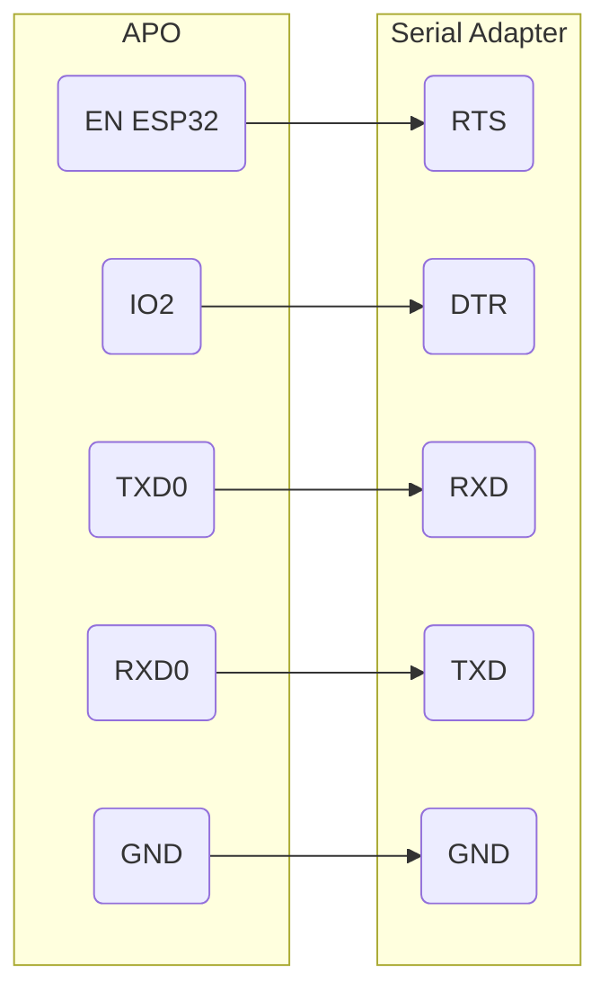

# Upgrading Firmware

## Prerequisites

- [esptool](https://docs.espressif.com/projects/esptool/en/latest/esp32/installation.html)
- [USB to Serial adapter (must have RTS and DTR pins)](https://www.amazon.com/dp/B00IJXZQ7C)
- [Female-to-female dupont connecting wires](https://www.amazon.com/dp/B01EV70C78)
- Anova Precision Oven firmware

## Configuration

1. Remove the rear cover of the oven.
2. Remove the plastic cover protecting the PCB.


3. Connect the USB-to-serial adapter to the debug pins.  In order to use the [automatic bootloader](https://docs.espressif.com/projects/esptool/en/latest/esp32/advanced-topics/boot-mode-selection.html#automatic-bootloader), all 5 pins must be connected as follows:




## Firmware Links

By using tcpdump to analyze traffic from my APO's I was able to see that firmware is available via public links.  See below for a changelog and available versions:

[Anova Changelog](https://support.anovaculinary.com/hc/en-us/articles/360058146272-Oven-Firmware-Changelog)

[1.0.0](https://storage.googleapis.com/anova-app.appspot.com/oven-firmware/oven-controller-1.0.0.bin), [1.0.1](https://storage.googleapis.com/anova-app.appspot.com/oven-firmware/oven-controller-1.0.1.bin), [1.1.9](https://storage.googleapis.com/anova-app.appspot.com/oven-firmware/oven-controller-1.1.9.bin), [1.1.20](https://storage.googleapis.com/anova-app.appspot.com/oven-firmware/oven-controller-1.1.20.bin), [1.1.23](https://storage.googleapis.com/anova-app.appspot.com/oven-firmware/oven-controller-1.1.23.bin), [1.1.31](https://storage.googleapis.com/anova-app.appspot.com/oven-firmware/oven-controller-1.1.31.bin), [1.1.32](https://storage.googleapis.com/anova-app.appspot.com/oven-firmware/oven-controller-1.1.32.bin), [1.1.33](https://storage.googleapis.com/anova-app.appspot.com/oven-firmware/oven-controller-1.1.33.bin), [1.2.7](https://storage.googleapis.com/anova-app.appspot.com/oven-firmware/oven-controller-1.2.7.bin), [1.2.10](https://storage.googleapis.com/anova-app.appspot.com/oven-firmware/oven-controller-1.2.10.bin), [1.4.17](https://storage.googleapis.com/anova-app.appspot.com/oven-firmware/oven-controller-1.4.17.bin), [1.4.18](https://storage.googleapis.com/anova-app.appspot.com/oven-firmware/oven-controller-1.4.18.bin), [1.4.21](https://storage.googleapis.com/anova-app.appspot.com/oven-firmware/oven-controller-1.4.21.bin), [1.4.24](https://storage.googleapis.com/anova-app.appspot.com/oven-firmware/oven-controller-1.4.24.bin)

[2.0.11](https://storage.googleapis.com/anova-app.appspot.com/oven-firmware/oven-controller-2.0.11.bin), [2.1.3](https://storage.googleapis.com/anova-app.appspot.com/oven-firmware/oven-controller-2.1.3.bin), [2.1.5](https://storage.googleapis.com/anova-app.appspot.com/oven-firmware/oven-controller-2.1.5.bin), [2.1.7](https://storage.googleapis.com/anova-app.appspot.com/oven-firmware/oven-controller-2.1.7.bin), [2.1.8](https://storage.googleapis.com/anova-app.appspot.com/oven-firmware/oven-controller-2.1.8.bin), [2.1.9](https://storage.googleapis.com/anova-app.appspot.com/oven-firmware/oven-controller-2.1.9.bin), [2.1.10](https://storage.googleapis.com/anova-app.appspot.com/oven-firmware/oven-controller-2.1.10.bin)


## Procedure

1. Connect to the APO as detailed in [Serial Console](/software/serial_console)
2. Download the desired firmware
3. **Back up your current flash**.  If you don't do this, there is no easy way back.
```
esptool.py --chip esp32 --port /dev/<serial-device> -b 230400 read_flash 0 ALL backup.bin
```
4. Erase the factory partition
```
esptool.py --chip esp32 --port /dev/<serial-device> -b 230400 erase_region 0x00010000 0x0012c000
```
5. Flash the firmware
```
esptool.py --chip esp32 --port /dev/<serial-device> -b 230400 write_flash 0x00010000 <path_to_firmware_bin> -u
```

6. Disconnect from the debug pins
7. Briefly unplug the APO

## Restoring From Backup

As long as you backed up the original firmware in the previous steps, you can always restore from backup.

```
esptool.py --chip esp32 --port /dev/<serial-device> -b 230400 write_flash 0 backup.bin -u -e
```